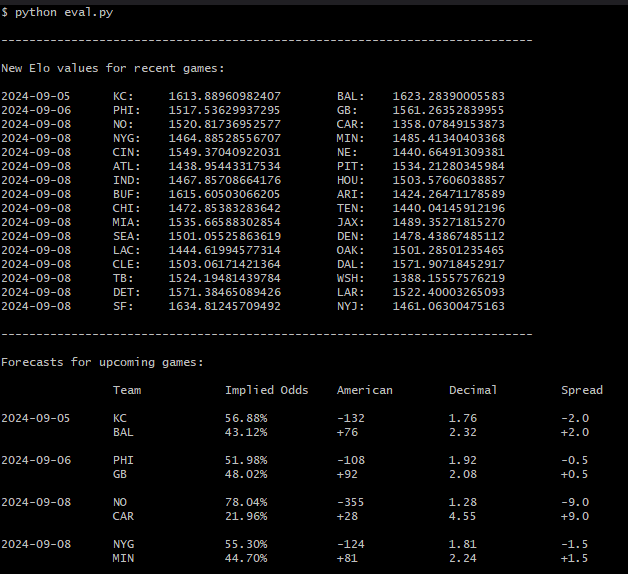

# NFL Predictions

This is an NFL prediction repository that is originally based on [FiveThirtyEight's NFL Forecasting model and repositories](https://github.com/fivethirtyeight/nfl-elo-game).
This repository has been stripped of its historical evaluations and focuses solely on future prediction.

## What it does

`eval.py` is the only runnable script, and does the following:

1. Reads in the CSV of historical games. Each row includes a `elo_prob1` field, which is the probability that `team1` will win the game according to the Elo model.
1. Fills in a `my_prob1` field for every game using code in `forecast.py`. By default, these are filled in using the exact same Elo model.
1. Prints the resulting Elo values for recently played games and creates/updates `nfl-elo-game-updated.csv` file for the new Elo values so that the `nfl-elo-game.csv` file can be updated for the next week of games after confirming results.
1. Lists forecasts for upcoming games, including win probabilities, spread, and decimal odds.

Simply run `python eval.py`.

Sample output:

